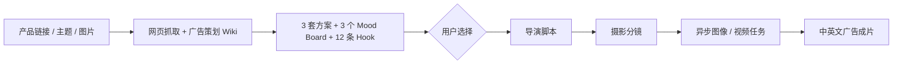

# 大海浮光 AIGC 工作台

**Ocean Glimmer — AI Design & AIGC Advertising Workbench**

> 面向电商与品牌内容团队的短视频智能生产系统

[60 秒看懂](#60-秒看懂) · [English Summary](#english-summary)

大海浮光 AIGC 工作台是一款面向电商与品牌内容团队的 AI 广告创意与制作产品。
   广告创作不是一次生成，而是从理解产品、选择创意，到脚本、分镜、影像和后期的一整套专业过程。现有 AIGC 工具大多只覆盖单个环节，用户需要在多个工具之间反复切换，很难持续参与并控制创意方向。
大海浮光将广告策划、编剧导演、摄影摄像和后期制作整合进一个工作台。用户导入商品链接、产品文档或图片后，系统先生    成产品简报和多套创意；用户确认 Hook、Mood Board 和广告表达后，多个专业 Agent 协同完成从脚本分镜到最终成片。
   用户掌握关键创意决策，Agent 负责专业知识调用、上下文衔接和制作执行，让 AIGC 从“单次生成”变成可参与、可控制的完整创作流程。
   
> **求职方向：**AIGC 视频产品经理 ·  Agent工程师（内容创作方向） · AI 应用开发

## 60 秒看懂

| 用时 | 查看内容 | 可以了解什么 | 入口 |
| --- | --- | --- | --- |
| 0–15 秒 | 中英文广告成片 | AI 视频生成、广告创意与视觉执行能力 | [中文成片](frontend/showcase/videos/new-feed-cn/huawei-feed-ad-3-reupload.mp4) · [英文成片](frontend/showcase/videos/new-feed-en/new-feed-en-veo-subtitled.mp4) · [完整视频作品](#视频作品直接播放) |
| 15–30 秒 | 工作台运行效果 | 从商品输入、方案选择到成片回写的实际产品流程 | [工作台运行快照](frontend/showcase/workbench/open-design-demo.html?demo=1) |
| 30–45 秒 | 完整决策案例 | 用户如何比较 Hook、Mood Board 和创意方案，并将选择传递到后续阶段 | [Case Study](docs/CASE_STUDY.md) |
| 45–60 秒 | 系统架构 | Python、模型、飞书知识库与 n8n 如何协同工作 | [系统架构](docs/ARCHITECTURE.md) |

> **一句话总结：**这是一个将广告创意能力转化为可运行 AI 产品的作品集项目，覆盖商品分析、创意决策、导演脚本、摄影分镜、异步视频生成和结果回写。

### 根据岗位快速查看

- **AI 产品 / AIGC 产品：**查看[工作台运行快照](frontend/showcase/workbench/open-design-demo.html?demo=1)和[Case Study](docs/CASE_STUDY.md)
- **AI 应用 / Agent 工作流：**查看[系统架构](docs/ARCHITECTURE.md)和[接口契约](docs/WORKFLOW_CONTRACTS.md)
- **AI 视频 / 创意技术：**查看[中英文视频目录](frontend/showcase/README.md)和[摄影分镜流程](docs/ARCHITECTURE.md)

## 视频作品｜直接播放

### 华为品牌信息流广告（中文）

<table>
<tr>
<td align="center" valign="top"><strong>华为品牌信息流广告（中文） · 成片 01</strong><br><video src="https://github.com/user-attachments/assets/a2b6bd37-f20e-4674-ace0-73b143865306" poster="https://raw.githubusercontent.com/luoxiaohe0529-creator/ocean-glimmer-aigc/main/frontend/showcase/covers/readme/video-01.jpg" controls preload="metadata" width="260"></video></td>
<td align="center" valign="top"><strong>华为品牌信息流广告（中文） · 成片 02</strong><br><video src="https://github.com/user-attachments/assets/9aa5d543-ece7-41b3-b7d7-f721f921ed45" poster="https://raw.githubusercontent.com/luoxiaohe0529-creator/ocean-glimmer-aigc/main/frontend/showcase/covers/readme/video-02.jpg" controls preload="metadata" width="260"></video></td>
<td align="center" valign="top"><strong>华为品牌信息流广告（中文） · 成片 03</strong><br><video src="https://github.com/user-attachments/assets/4d1ed4b6-5cdf-4ee9-9df6-6773d5bebb49" poster="https://raw.githubusercontent.com/luoxiaohe0529-creator/ocean-glimmer-aigc/main/frontend/showcase/covers/readme/video-03.jpg" controls preload="metadata" width="260"></video></td>
</tr>
<tr>
<td align="center" valign="top"><strong>华为品牌信息流广告（中文） · 成片 04</strong><br><video src="https://github.com/user-attachments/assets/47d3e23e-1b7d-4252-98f4-5c41229b67c5" poster="https://raw.githubusercontent.com/luoxiaohe0529-creator/ocean-glimmer-aigc/main/frontend/showcase/covers/readme/video-04.jpg" controls preload="metadata" width="260"></video></td>
<td align="center" valign="top"><strong>华为品牌信息流广告（中文） · 成片 05</strong><br><video src="https://github.com/user-attachments/assets/78d4dbd7-4061-4df9-a7ac-3a1d5d6faecd" poster="https://raw.githubusercontent.com/luoxiaohe0529-creator/ocean-glimmer-aigc/main/frontend/showcase/covers/readme/video-05.jpg" controls preload="metadata" width="260"></video></td>
<td align="center" valign="top"><strong>华为品牌信息流广告（中文） · 成片 06</strong><br><video src="https://github.com/user-attachments/assets/7ad550b3-ca6c-449d-8395-27ea72557598" poster="https://raw.githubusercontent.com/luoxiaohe0529-creator/ocean-glimmer-aigc/main/frontend/showcase/covers/readme/video-06.jpg" controls preload="metadata" width="260"></video></td>
</tr>
</table>

### 跨境电商（英语）

<table>
<tr>
<td align="center" valign="top"><strong>跨境电商（英语） · 成片 01</strong><br><video src="https://github.com/user-attachments/assets/89dbc529-be56-451a-b519-25c1ebd6336d" poster="https://raw.githubusercontent.com/luoxiaohe0529-creator/ocean-glimmer-aigc/main/frontend/showcase/covers/readme/video-07.jpg" controls preload="metadata" width="260"></video></td>
<td align="center" valign="top"><strong>跨境电商（英语） · 成片 02</strong><br><video src="https://github.com/user-attachments/assets/5a82f673-3e03-4cf7-b2c8-fd211caa86ec" poster="https://raw.githubusercontent.com/luoxiaohe0529-creator/ocean-glimmer-aigc/main/frontend/showcase/covers/readme/video-08.jpg" controls preload="metadata" width="260"></video></td>
<td align="center" valign="top"><strong>跨境电商（英语） · 成片 03</strong><br><video src="https://github.com/user-attachments/assets/13b5815e-25a3-40d1-bc16-f4d1ea0f3ff8" poster="https://raw.githubusercontent.com/luoxiaohe0529-creator/ocean-glimmer-aigc/main/frontend/showcase/covers/readme/video-09.jpg" controls preload="metadata" width="260"></video></td>
</tr>
<tr>
<td align="center" valign="top"><strong>跨境电商（英语） · 成片 04</strong><br><video src="https://github.com/user-attachments/assets/83e6e35c-5cce-40f1-bdef-d5bc68909fac" poster="https://raw.githubusercontent.com/luoxiaohe0529-creator/ocean-glimmer-aigc/main/frontend/showcase/covers/readme/video-10.jpg" controls preload="metadata" width="260"></video></td>
<td align="center" valign="top"><strong>跨境电商（英语） · 成片 05</strong><br><video src="https://github.com/user-attachments/assets/7f18632a-feb7-4620-b480-6b25e832b695" poster="https://raw.githubusercontent.com/luoxiaohe0529-creator/ocean-glimmer-aigc/main/frontend/showcase/covers/readme/video-11.jpg" controls preload="metadata" width="260"></video></td>
<td align="center" valign="top"><strong>跨境电商（英语） · 成片 06</strong><br><video src="https://github.com/user-attachments/assets/f5cad393-a241-482a-a299-ccbc084a1af2" poster="https://raw.githubusercontent.com/luoxiaohe0529-creator/ocean-glimmer-aigc/main/frontend/showcase/covers/readme/video-12.jpg" controls preload="metadata" width="260"></video></td>
</tr>
</table>

### 品牌 TVC｜原创

<table>
<tr>
<td align="center" valign="top"><strong>品牌 TVC · 雅诗兰黛小棕瓶</strong><br><video src="https://github.com/user-attachments/assets/d17a4993-5dfb-4898-b33d-7683e469e078" poster="https://raw.githubusercontent.com/luoxiaohe0529-creator/ocean-glimmer-aigc/main/frontend/showcase/covers/readme/video-15.jpg" controls preload="metadata" width="560"></video></td>
<td align="center" valign="top"><strong>品牌 TVC · 大海浮光汽水</strong><br><video src="https://github.com/user-attachments/assets/bb826e2f-81f7-4244-9ac6-a4e15ac336f6" poster="https://raw.githubusercontent.com/luoxiaohe0529-creator/ocean-glimmer-aigc/main/frontend/showcase/covers/readme/video-13.jpg" controls preload="metadata" width="560"></video></td>
</tr>
<tr>
<td align="center" valign="top"><strong>品牌 TVC · 大海浮光羽绒服</strong><br><video src="https://github.com/user-attachments/assets/8f215e76-6bd9-4f19-a9f2-4c8dab24ea8f" poster="https://raw.githubusercontent.com/luoxiaohe0529-creator/ocean-glimmer-aigc/main/frontend/showcase/covers/readme/video-14.jpg" controls preload="metadata" width="560"></video></td>
<td></td>
</tr>
</table>

## English Summary

Ocean Glimmer is an AI advertising production system that turns product links, marketing requirements, and reference images into structured advertising concepts, director scripts, shot lists, and short-form videos.

It was created to reduce repeated product-information collection, disconnected creative tools, single-option AI outputs, and long-running video tasks with no visible status. The workbench brings these steps into one browser-based workflow:

1. analyse the product and organise its selling points, audience, usage scenarios, and communication priorities;
2. read role-specific advertising knowledge from Feishu Wiki;
3. generate three complete creative directions and twelve hooks for comparison;
4. let the user select the preferred hook and visual direction;
5. convert the selected concept into a director script and cinematography plan;
6. submit image and video generation tasks, display progress, retain error details, and write the completed video back to the workbench.

The system separates advertising planning, directing, cinematography, and media execution instead of asking one model to complete everything in a single prompt. Human judgment is built into the key creative decisions, while structured state and task polling keep the workflow selectable, traceable, and recoverable.

**Recruiter takeaway:** This project demonstrates advertising and visual-design judgment, AI product thinking, and the ability to turn creative capability into a working, repeatable content-production system.

## 我解决的问题

直接调用大模型生成广告，通常会遇到四个问题：

- 商品网页信息缺少结构化整理，容易在后续创意生成中遗漏或被错误扩展；
- 模型一次只给出一个方向，用户没有真正的决策点；
- Hook、脚本、分镜和成片之间容易失去上下文；
- 视频生成耗时较长，任务状态和最终结果难以稳定回写。

因此，我把生产过程拆成三个内容决策阶段和一个媒体执行阶段：



## 产品设计思维

### 1｜先帮助用户做决策，再由系统继续执行

Stage 1 先提供可比较的 Hook、Mood Board 和创意方案，由用户确定方向后再进入导演与摄影阶段。用户选择会以 `plan_id`、`hook_id` 和 `mood_board_id` 继续传递，而不是被下一次模型调用覆盖。

### 2｜知识库负责方法，模型负责推理

飞书 Wiki 被划分为广告策划、编剧导演和摄影摄像三个知识域。每个阶段只读取与当前角色有关的专业知识，并通过 `knowledge_trace` 记录实际读取状态，使知识来源与运行数据保持分离。

### 3｜内容生成与媒体任务分开

Python 负责知识读取、模型调用、模板路由和结构化契约；n8n 负责图片、视频、轮询、对象存储和结果回写。这样可以独立替换模型或媒体供应商，而不必重写整条业务流程。

### 4｜长任务不会阻塞前端

视频生成会立即返回任务 ID，前端随后轮询状态。最终视频与上游产品简报、创意方案、分辨率和 `pipeline_trace` 一起保存，页面刷新后仍可恢复结果。

## 本项目展示的能力

| 能力 | 项目中的落地 |
| --- | --- |
| AI 产品设计 | 将广告生产拆成可验证阶段，并设置人工创意决策点 |
| Agent / 工作流 | 广告策划、导演、摄影角色分工与上下文交接 |
| 多模态应用 | 同时处理产品网页、营销主题和产品图片 |
| 知识库应用 | 飞书 Wiki 分角色读取、知识来源追踪，读取失败时明确返回错误 |
| 结构化生成 | 通过 Pydantic、ID 和 JSON contract 连接不同阶段 |
| 模型路由 | KIE Gemini 3.1 Pro、DeepSeek 及图像/视频模型按阶段与语言分工 |
| 异步编排 | n8n 任务提交、状态轮询、失败处理和结果回写 |
| 工程交付 | Node 同源代理、TOS 对象存储、FFmpeg、测试与敏感信息扫描 |

## 技术架构

| 层级 | 技术 | 职责 |
| --- | --- | --- |
| 前端 | HTML、CSS、JavaScript | 产品输入、方案选择、阶段确认、媒体预览 |
| 网关 | Node.js | 静态服务、同源 API 代理、状态保存与恢复 |
| AI 内容服务 | Python、Pydantic | 抓取、知识读取、模型路由、输出校验 |
| 知识层 | 飞书 Wiki | 广告策划、编剧导演、摄影摄像方法论 |
| 创意与多模态模型 | KIE Gemini 3.1 Pro | 产品简报、创意方案、Mood Board、Hook、中文导演脚本与摄影分镜 |
| 英文脚本模型 | DeepSeek | 根据用户选定的创意方向生成英文导演脚本 |
| 编排层 | n8n | 图像与视频任务、等待、轮询、回写 |
| 媒体层 | 火山 TOS、FFmpeg | 公网素材、生成结果与本地后期处理 |

## 真实生产链路

1. 网页抓取与广告策划 Wiki 并发读取。
2. KIE Gemini 3.1 Pro 读取产品图、营销要求和广告策划知识，一次生成产品简报、3 个 Mood Board、3 套方案和 12 条 Hook。
3. 用户选择 Hook 后，系统读取编剧导演 Wiki；中文脚本由 KIE Gemini 3.1 Pro 生成，英文脚本使用 DeepSeek。
4. 摄影阶段读取摄影摄像 Wiki，由 KIE Gemini 3.1 Pro 将脚本转换为逐镜任务和视频提示词。
5. n8n 提交图像和视频媒体任务并轮询状态，最终将成片回写到前端。

## 我实际处理过的工程问题

- 飞书 Wiki 权限、节点类型和文档读取失败；
- 本地图片无法被远程多模态模型访问；
- 模型连接中断、超时、返回字段变化和结构化结果缺失；
- 前端重复提交导致同一 Stage 被触发两次；
- 本地服务端口冲突与多进程重复启动；
- 视频任务耗时较长，HTTP 请求不应一直阻塞；
- 分辨率、Hook 和创意方案在多阶段传递中丢失；
- 视频生成成功但前端未收到最终回写；
- 公开仓库中 API Key、工作流凭据和对象存储地址的泄露风险。

## 项目结构

```text
.
├── frontend/
│   ├── open-design.html       # 正式工作台
│   ├── portfolio.html         # 作品集页面
│   └── server.mjs             # Node 网关与统一代理
├── python_service/
│   ├── server.py              # Stage 1 / 2 / 3 API
│   ├── prompts.py             # 结构化提示词契约
│   ├── feishu_knowledge.py    # Wiki 知识读取
│   ├── gemini_kie.py          # KIE Gemini 3.1 Pro 通道
│   └── deepseek.py            # 英文导演脚本生成通道
├── n8n-workflows/public/      # 脱敏公开工作流
├── docs/knowledge/            # 三类知识库整理版
├── docs/                      # 架构、Case Study 与接口文档
├── scripts/                   # 检查、导出和安装工具
├── .env.example
└── package.json
```

## 本地运行

```bash
npm install
python3 -m pip install -r python_service/requirements.txt
npm exec playwright install chromium
cp .env.example .env
npm start
```

默认入口：

- 工作台：<http://localhost:4174>
- Python 健康检查：<http://127.0.0.1:8787/health>
- n8n：<http://127.0.0.1:5678>（独立启动）

详细配置见 [安装说明](docs/SETUP.md)。真实密钥只存放在本机 `.env` 或 n8n Credentials 中。

## 质量与公开安全

```bash
npm run check
```

检查覆盖 Node 入口、Python 单元测试、公开 n8n 工作流、阶段数据契约及敏感信息。GitHub Actions 会在 push 和 Pull Request 时执行同一套检查。

公开仓库不包含 `.env`、API Key、n8n 数据库、Credential、真实业务记录、私有对象存储地址和本机运行日志。

## 当前边界

- 当前是可运行、可检查、可展示的 AI 应用原型，不将单次生成质量包装成商业 SLA。
- 真实运行需要使用者自己的模型、飞书、TOS 与 n8n 凭据。
- 下一步计划增加多国家本地化、批量矩阵生成、成本统计与传播数据反馈。

## 进一步阅读

- [Case Study](docs/CASE_STUDY.md)
- [系统架构](docs/ARCHITECTURE.md)
- [接口契约](docs/WORKFLOW_CONTRACTS.md)
- [飞书知识库接入](docs/FEISHU_KNOWLEDGE.md)
- [GitHub 发布检查](docs/GITHUB_RELEASE.md)
