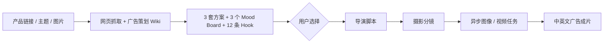

# 大海浮光｜跨境电商短视频智能生产系统

**Ocean Glimmer — AI Design & AIGC Advertising Workbench**
## 项目介绍

### 01｜产品定位

大海浮光 AIGC 工作台是一套面向跨境电商与品牌内容团队的短视频智能生产系统。用户输入商品链接、营销要求和产品图片后，系统依次完成商品分析、创意方案生成、导演脚本、摄影分镜和短视频生成。

### 02｜用户问题

传统广告制作需要在商品资料整理、创意策划、脚本撰写、分镜设计和多个生成工具之间反复切换。整个流程高度依赖个人经验，产品信息、用户选择和创意方向也容易在跨阶段传递中丢失。

### 03｜解决方案

大海浮光 AIGC 工作台将广告生产拆分为商品理解、创意决策、脚本分镜和媒体执行四个阶段。

系统结合飞书广告知识库，一次生成3套创意方案、3组 Mood Board 和12条 Hook。用户比较并确认方向后，系统再继续生成导演脚本、摄影分镜并提交视频任务，同时显示任务状态、保留失败信息并将成片回写到工作台。

### 04｜项目价值

项目关注的不只是生成一条视频，更关注如何让产品事实、专业知识、人的创意判断和异步媒体任务稳定衔接，形成一条可选择、可追踪、可恢复的广告生产链。

60 秒看懂
用时	查看内容	可以了解什么	入口
0–15 秒	中英文广告成片	AI视频生成、广告创意与视觉执行能力	[中文成片](frontend/showcase/videos/中文视频-国内电商/美白奶罐_高端TVC_0729_0434.mp4) · [English Cut](frontend/showcase/videos/英文视频-跨境电商/veo-2_字幕.mp4) · [完整视频目录](frontend/showcase/README.md)
15–30 秒	工作台运行效果	从商品输入、方案选择到成片回写的实际产品流程	[工作台运行快照](frontend/showcase/workbench/open-design-demo.html?demo=1)
30–45 秒	完整决策案例	用户如何比较 Hook、Mood Board 和创意方案，并将选择传递到后续阶段	[Case Study](docs/CASE_STUDY.md)
45–60 秒	系统架构	Python、模型、飞书知识库与 n8n 如何协同工作	[系统架构](docs/ARCHITECTURE.md)


**一句话总结：**这是一个将广告创意能力转化为可运行 AI 产品的作品集项目，覆盖商品分析、创意决策、导演脚本、摄影分镜、异步视频生成和结果回写。

根据岗位快速查看
**AI 产品 / AIGC 产品：**查看[工作台运行快照](frontend/showcase/workbench/open-design-demo.html?demo=1)和[Case Study](docs/CASE_STUDY.md)
**AI 应用 / Agent 工作流：**查看[系统架构](docs/ARCHITECTURE.md)和[接口契约](docs/WORKFLOW_CONTRACTS.md)
**AI 视频 / 创意技术：**查看[中英文视频目录](frontend/showcase/README.md)和[摄影分镜流程](docs/ARCHITECTURE.md)
> 求职方向：AIGC 应用 · AI 产品 · Agent 工作流 · Creative Technologist · 跨境内容自动化

### 视频作品｜直接播放

中文视频区仅保留华为品牌信息流作品。每条成片的第 1 秒都是产品封面，GitHub 页面可直接播放。

#### 中文信息流广告

<table>
<tr>
<td><strong>01｜华为品牌信息流 · 广告 1</strong><br><video src="https://github.com/user-attachments/assets/bb893083-e30f-411b-a85a-139d430d5e97" controls preload="metadata" width="280"></video></td>
<td><strong>02｜华为品牌信息流 · 广告 2</strong><br><video src="https://github.com/user-attachments/assets/9aa5d543-ece7-41b3-b7d7-f721f921ed45" controls preload="metadata" width="280"></video></td>
<td><strong>03｜华为品牌信息流 · 广告 3</strong><br><video src="https://github.com/user-attachments/assets/b500b609-b2a1-4217-a32d-d1d02b5e4fdc" controls preload="metadata" width="280"></video></td>
</tr>
<tr>
<td><strong>04｜华为品牌信息流 · 广告 4</strong><br><video src="https://github.com/user-attachments/assets/0dffd6f9-0732-4876-a7db-2a06b4ab83da" controls preload="metadata" width="280"></video></td>
<td><strong>05｜华为品牌信息流 · 广告 5</strong><br><video src="https://github.com/user-attachments/assets/78d4dbd7-4061-4df9-a7ac-3a1d5d6faecd" controls preload="metadata" width="280"></video></td>
<td></td>
</tr>
</table>

#### 英文信息流广告

<table>
<tr>
<td><strong>01｜英文跨境美妆广告 · Veo 2</strong><br><video src="https://github.com/user-attachments/assets/b82b5d82-b9d3-47dd-bb2e-9ba677fc7e44" controls preload="metadata" width="280"></video></td>
<td><strong>02｜英文跨境美妆广告 · 成片 01</strong><br><video src="https://github.com/user-attachments/assets/ed88cbeb-ea46-4af5-a6c6-eecf10247824" controls preload="metadata" width="280"></video></td>
<td><strong>03｜英文跨境美妆广告 · 成片 02</strong><br><video src="https://github.com/user-attachments/assets/ffd38ee5-c3b0-430b-895e-4f399d730536" controls preload="metadata" width="280"></video></td>
</tr>
<tr>
<td><strong>04｜英文跨境美妆广告 · 成片 03</strong><br><video src="https://github.com/user-attachments/assets/33156b11-8f0d-4dae-bc9c-39503998fd3b" controls preload="metadata" width="280"></video></td>
<td><strong>05｜英文跨境美妆广告 · 成片 04</strong><br><video src="https://github.com/user-attachments/assets/7ffb2da2-f0a5-404e-8984-9c5b28f3ef45" controls preload="metadata" width="280"></video></td>
<td></td>
</tr>
</table>

## English Summary

Ocean Glimmer AIGC Workbench is an AI-powered advertising production system that transforms product links, marketing requirements, and reference images into structured creative concepts, directing scripts, shot-by-shot cinematography plans, and short-form advertising videos.
The project addresses four recurring problems in AI-assisted advertising production: repeated product research, fragmented creative tools, single-option AI outputs, and long-running media tasks with limited status visibility. It brings the complete workflow into one browser-based workbench:
1. Analyse the product and structure its selling points, target audience, usage scenarios, and communication priorities.
2. Retrieve role-specific advertising knowledge from Feishu Wiki.
3. Generate three creative directions, three mood boards, and twelve hooks for comparison.
4. Let the user select the preferred hook and visual direction.
5. Turn the selected concept into a directing script and shot-by-shot cinematography plan.
6. Submit image and video generation tasks, display progress, retain error details, and return the completed video to the workbench.

Rather than asking a single model to complete the entire process in one prompt, the system separates product analysis, advertising planning, directing, cinematography, and media execution into distinct stages. Human judgment is built into the key creative decision point, while structured state management and asynchronous task polling keep the workflow selectable, traceable, and recoverable.
Recruiter takeaway: This project demonstrates advertising and visual-design judgment, AI product thinking, and the ability to turn creative expertise into a working, repeatable content-production system.

## 我解决的问题

直接调用大模型生成广告，通常会遇到四个问题：

- 产品事实容易被创意内容污染；
- 模型一次只给出一个方向，用户没有真正的决策点；
- Hook、脚本、分镜和成片之间容易失去上下文；
- 视频生成耗时较长，任务状态和最终结果难以稳定回写。

因此，我把生产过程拆成三个内容决策阶段和一个媒体执行阶段：



## 关键产品设计

1｜先帮助用户做决策，再由系统继续执行
广告创意没有唯一答案，因此大海浮光 AIGC 工作台不会直接从商品信息生成一条固定成片。系统先提供3套创意方案、3组 Mood Board 和12条 Hook，让用户比较并确认方向，再进入导演脚本、摄影分镜和视频生成阶段。被选中的方向通过 plan_id、hook_id 和 mood_board_id 贯穿后续流程，确保脚本、分镜和最终成片始终延续用户确认过的创意判断。

2｜把专业经验沉淀为可复用的方法
系统将广告策划、编剧导演和摄影摄像的方法分别沉淀到飞书 Wiki。每个阶段只读取当前角色所需的专业知识，再由模型结合具体商品完成分析与内容生成。
系统通过 knowledge_trace 记录实际读取的知识来源，使生成过程可以追踪，同时避免把历史运行数据误当成专业方法重复调用。

3｜按照产品职责拆分系统能力
Python负责商品分析、知识读取、模型调用、模板路由和结构化校验；n8n负责素材上传、图片与视频生成、任务轮询、对象存储和结果回写。
内容决策与媒体执行相互独立。后续替换文本模型、图像模型或视频供应商时，可以保留原有的业务流程和数据结构，降低系统调整成本。

4｜为长时间生成设计完整反馈
视频生成属于高延迟任务。系统提交任务后立即返回任务ID，前端持续展示生成中、成功或失败状态，避免用户在等待过程中失去反馈。
任务结果会与产品简报、创意方案、用户选择、分辨率和流程记录共同保存。即使页面刷新，用户也能恢复任务状态并继续查看最终成片。

## 本项目展示的能力
| 能力 | 项目中的落地 |
| --- | --- |
| AI 产品设计 | 将广告生产拆成可验证阶段，并设置人工创意决策点 |
| Agent / 工作流 | 广告策划、导演、摄影角色分工与上下文交接 |
| 多模态应用 | 同时处理产品网页、营销主题和产品图片 |
| 知识库应用 | 飞书 Wiki 分角色读取、知识追踪、无静默本地替代 |
| 结构化生成 | 通过 Pydantic、ID 和 JSON contract 连接不同阶段 |
| 模型路由 | Gemini、DeepSeek及图像/视频模型按阶段与语言分工 |
| 异步编排 | n8n 任务提交、状态轮询、失败处理和结果回写 |
| 工程交付 | Node 同源代理、TOS 对象存储、FFmpeg、测试与敏感信息扫描 |

## 技术架构

| 层级 | 技术 | 职责 |
| --- | --- | --- |
| 前端 | HTML、CSS、JavaScript | 产品输入、方案选择、阶段确认、媒体预览 |
| 网关 | Node.js | 静态服务、同源 API 代理、状态保存与恢复 |
| AI 内容服务 | Python、Pydantic | 抓取、知识读取、模型路由、输出校验 |
| 知识层 | 飞书 Wiki | 广告策划、编剧导演、摄影摄像方法论 |
| 文本与多模态模型 | Gemini 3.1 Pro、DeepSeek | Hook、Mood Board、脚本、摄影分镜 |
| 编排层 | n8n | 图像与视频任务、等待、轮询、回写 |
| 媒体层 | 火山 TOS、FFmpeg | 公网素材、生成结果与本地后期处理 |

## 真实生产链路

1. 网页抓取与广告策划 Wiki 并发读取。
2. Gemini 3.1 Pro 读取产品图和知识，一次生成产品简报、3 个 Mood Board、3 套方案和12条 Hook。
3. 用户选择 Hook 后，系统读取编剧导演 Wiki，生成完整导演脚本。
4. 摄影阶段读取摄影摄像 Wiki，将脚本转换为逐镜任务和视频提示词。
5. n8n 提交媒体任务并轮询状态，最终将成片回写到前端。

## 我实际处理过的工程问题

- 飞书 Wiki 权限、节点类型和文档读取失败；
- 本地图片无法被远程多模态模型访问；
- 模型连接中断、超时、返回字段变化和结构化结果缺失；
- 前端重复提交导致同一 Stage 被触发两次；
- 本地服务端口冲突与多进程重复启动；
- 视频任务耗时较长，HTTP 请求不应一直阻塞；
- 分辨率、Hook 和创意方案在多阶段传递中丢失；
- 视频生成成功但前端未收到最终回写；
- API Key、工作流凭据和对象存储地址的公开安全边界。

## 项目结构

```text
.
├── frontend/
│   ├── open-design.html       # 正式工作台
│   ├── portfolio.html         # 作品集页面
│   └── server.mjs             # Node 网关与统一代理
├── python_service/
│   ├── server.py              # Stage 1 / 2 / 3 API
│   ├── prompts.py             # 结构化提示词契约
│   ├── feishu_knowledge.py    # Wiki 知识读取
│   └── gemini_kie.py          # Gemini 3.1 Pro 通道
├── n8n-workflows/public/      # 脱敏公开工作流
├── docs/knowledge/            # 三类知识库整理版
├── docs/                      # 架构、Case Study 与接口文档
├── scripts/                   # 检查、导出和安装工具
├── .env.example
└── package.json
```

## 本地运行

```bash
npm install
python3 -m pip install -r python_service/requirements.txt
npm exec playwright install chromium
cp .env.example .env
npm start
```

默认入口：

- 工作台：<http://localhost:4174>
- Python 健康检查：<http://127.0.0.1:8787/health>
- n8n：<http://127.0.0.1:5678>（独立启动）

详细配置见 [安装说明](docs/SETUP.md)。真实密钥只存放在本机 `.env` 或 n8n Credentials 中。

## 质量与公开安全

```bash
npm run check
```

检查覆盖 Node 入口、Python 单元测试、公开 n8n 工作流、阶段数据契约及敏感信息。GitHub Actions 会在 push 和 Pull Request 时执行同一套检查。

公开仓库不包含 `.env`、API Key、n8n 数据库、Credential、真实业务记录、私有对象存储地址和本机运行日志。

## 当前边界

- 当前是可运行、可检查、可展示的 AI 应用原型，不将单次生成质量包装成商业 SLA。
- 真实运行需要使用者自己的模型、飞书、TOS 与 n8n 凭据。
- 下一步计划增加多国家本地化、批量矩阵生成、成本统计与传播数据反馈。

## 进一步阅读

- [Case Study](docs/CASE_STUDY.md)
- [系统架构](docs/ARCHITECTURE.md)
- [接口契约](docs/WORKFLOW_CONTRACTS.md)
- [飞书知识库接入](docs/FEISHU_KNOWLEDGE.md)
- [GitHub 发布检查](docs/GITHUB_RELEASE.md)
