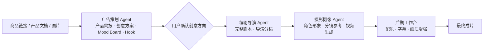

# 大海浮光 AIGC 工作台

**Ocean Glimmer — AI Advertising Creation & Production Workbench**

> 大海浮光 AIGC 工作台是面向电商与品牌内容团队的 AI 广告创意与制作产品

**广告创作不是一次生成**，而是从理解产品、选择创意，到脚本、分镜、影像和后期的一整套专业过程。现有 AIGC 工具大多只覆盖单个环节，用户需要在多个工具之间反复切换，很难持续参与并控制创意方向。

**大海浮光 AIGC 工作台**将广告策划、编剧导演、摄影摄像和后期制作整合进一个工作台。用户导入商品链接、产品文档或图片后，系统先生成**产品简报和多套创意**；用户确认 **Hook、Mood Board 和广告表达**后，多个专业 Agent 协同完成从脚本分镜到最终成片。

**用户掌握关键创意决策，Agent 负责专业知识调用、上下文衔接和制作执行**，让 AIGC 从“单次生成”变成一套**可参与、可控制的完整创作流程**。
   
> **求职方向：**AIGC 视频产品经理 ·  Agent 工程师（内容创作方向） · AI 应用开发

## 60 秒看懂

| 用时 | 查看内容 | 可以了解什么 | 入口 |
| --- | --- | --- | --- |
| 0–15 秒 | 中英文广告成片 | AI 视频生成、广告创意与视觉执行能力 | [中文成片](frontend/showcase/videos/new-feed-cn/huawei-feed-ad-3-reupload.mp4) · [英文成片](frontend/showcase/videos/new-feed-en/new-feed-en-veo-subtitled.mp4) · [完整视频作品](#视频作品直接播放) |
| 15–30 秒 | 工作台运行效果 | 从商品输入、方案选择到成片回写的实际产品流程 | [工作台运行快照](frontend/showcase/workbench/open-design-demo.html?demo=1) |
| 30–45 秒 | 完整决策案例 | 用户如何比较 Hook、Mood Board 和创意方案，并将选择传递到后续阶段 | [Case Study](docs/CASE_STUDY.md) |
| 45–60 秒 | 系统架构 | Python、模型、飞书知识库与 n8n 如何协同工作 | [系统架构](docs/ARCHITECTURE.md) |

> > **一句话总结：**这是一个由专业 Agent 协作驱动的 AIGC 广告工作台，用户掌握决策，系统完成从产品 Brief、脚本分镜、影像生成到后期交付的完整流程。

### 根据岗位快速查看

- **AI 产品 / AIGC 产品：**查看[工作台运行快照](frontend/showcase/workbench/open-design-demo.html?demo=1)和[Case Study](docs/CASE_STUDY.md)
- **AI 应用 / Agent 工作流：**查看[系统架构](docs/ARCHITECTURE.md)和[接口契约](docs/WORKFLOW_CONTRACTS.md)
- **AI 视频 / 创意技术：**查看[中英文视频目录](frontend/showcase/README.md)和[摄影分镜流程](docs/ARCHITECTURE.md)

## 视频作品｜直接播放

### 华为品牌信息流广告（中文）

<table>
<tr>
<td align="center" valign="top"><strong>华为品牌信息流广告（中文） · 成片 01</strong><br><video src="https://github.com/user-attachments/assets/a2b6bd37-f20e-4674-ace0-73b143865306" poster="https://raw.githubusercontent.com/luoxiaohe0529-creator/ocean-glimmer-aigc/main/frontend/showcase/covers/readme/video-01.jpg" controls preload="metadata" width="260"></video></td>
<td align="center" valign="top"><strong>华为品牌信息流广告（中文） · 成片 02</strong><br><video src="https://github.com/user-attachments/assets/9aa5d543-ece7-41b3-b7d7-f721f921ed45" poster="https://raw.githubusercontent.com/luoxiaohe0529-creator/ocean-glimmer-aigc/main/frontend/showcase/covers/readme/video-02.jpg" controls preload="metadata" width="260"></video></td>
<td align="center" valign="top"><strong>华为品牌信息流广告（中文） · 成片 03</strong><br><video src="https://github.com/user-attachments/assets/4d1ed4b6-5cdf-4ee9-9df6-6773d5bebb49" poster="https://raw.githubusercontent.com/luoxiaohe0529-creator/ocean-glimmer-aigc/main/frontend/showcase/covers/readme/video-03.jpg" controls preload="metadata" width="260"></video></td>
</tr>
<tr>
<td align="center" valign="top"><strong>华为品牌信息流广告（中文） · 成片 04</strong><br><video src="https://github.com/user-attachments/assets/47d3e23e-1b7d-4252-98f4-5c41229b67c5" poster="https://raw.githubusercontent.com/luoxiaohe0529-creator/ocean-glimmer-aigc/main/frontend/showcase/covers/readme/video-04.jpg" controls preload="metadata" width="260"></video></td>
<td align="center" valign="top"><strong>华为品牌信息流广告（中文） · 成片 05</strong><br><video src="https://github.com/user-attachments/assets/78d4dbd7-4061-4df9-a7ac-3a1d5d6faecd" poster="https://raw.githubusercontent.com/luoxiaohe0529-creator/ocean-glimmer-aigc/main/frontend/showcase/covers/readme/video-05.jpg" controls preload="metadata" width="260"></video></td>
<td align="center" valign="top"><strong>华为品牌信息流广告（中文） · 成片 06</strong><br><video src="https://github.com/user-attachments/assets/7ad550b3-ca6c-449d-8395-27ea72557598" poster="https://raw.githubusercontent.com/luoxiaohe0529-creator/ocean-glimmer-aigc/main/frontend/showcase/covers/readme/video-06.jpg" controls preload="metadata" width="260"></video></td>
</tr>
</table>

### 跨境电商（英语）

<table>
<tr>
<td align="center" valign="top"><strong>跨境电商（英语） · 成片 01</strong><br><video src="https://github.com/user-attachments/assets/89dbc529-be56-451a-b519-25c1ebd6336d" poster="https://raw.githubusercontent.com/luoxiaohe0529-creator/ocean-glimmer-aigc/main/frontend/showcase/covers/readme/video-07.jpg" controls preload="metadata" width="260"></video></td>
<td align="center" valign="top"><strong>跨境电商（英语） · 成片 02</strong><br><video src="https://github.com/user-attachments/assets/5a82f673-3e03-4cf7-b2c8-fd211caa86ec" poster="https://raw.githubusercontent.com/luoxiaohe0529-creator/ocean-glimmer-aigc/main/frontend/showcase/covers/readme/video-08.jpg" controls preload="metadata" width="260"></video></td>
<td align="center" valign="top"><strong>跨境电商（英语） · 成片 03</strong><br><video src="https://github.com/user-attachments/assets/13b5815e-25a3-40d1-bc16-f4d1ea0f3ff8" poster="https://raw.githubusercontent.com/luoxiaohe0529-creator/ocean-glimmer-aigc/main/frontend/showcase/covers/readme/video-09.jpg" controls preload="metadata" width="260"></video></td>
</tr>
<tr>
<td align="center" valign="top"><strong>跨境电商（英语） · 成片 04</strong><br><video src="https://github.com/user-attachments/assets/83e6e35c-5cce-40f1-bdef-d5bc68909fac" poster="https://raw.githubusercontent.com/luoxiaohe0529-creator/ocean-glimmer-aigc/main/frontend/showcase/covers/readme/video-10.jpg" controls preload="metadata" width="260"></video></td>
<td align="center" valign="top"><strong>跨境电商（英语） · 成片 05</strong><br><video src="https://github.com/user-attachments/assets/7f18632a-feb7-4620-b480-6b25e832b695" poster="https://raw.githubusercontent.com/luoxiaohe0529-creator/ocean-glimmer-aigc/main/frontend/showcase/covers/readme/video-11.jpg" controls preload="metadata" width="260"></video></td>
<td align="center" valign="top"><strong>跨境电商（英语） · 成片 06</strong><br><video src="https://github.com/user-attachments/assets/f5cad393-a241-482a-a299-ccbc084a1af2" poster="https://raw.githubusercontent.com/luoxiaohe0529-creator/ocean-glimmer-aigc/main/frontend/showcase/covers/readme/video-12.jpg" controls preload="metadata" width="260"></video></td>
</tr>
</table>

### 品牌 TVC｜原创

<table>
<tr>
<td align="center" valign="top"><strong>品牌 TVC · 雅诗兰黛小棕瓶</strong><br><video src="https://github.com/user-attachments/assets/d17a4993-5dfb-4898-b33d-7683e469e078" poster="https://raw.githubusercontent.com/luoxiaohe0529-creator/ocean-glimmer-aigc/main/frontend/showcase/covers/readme/video-15.jpg" controls preload="metadata" width="560"></video></td>
<td align="center" valign="top"><strong>品牌 TVC · 大海浮光汽水</strong><br><video src="https://github.com/user-attachments/assets/bb826e2f-81f7-4244-9ac6-a4e15ac336f6" poster="https://raw.githubusercontent.com/luoxiaohe0529-creator/ocean-glimmer-aigc/main/frontend/showcase/covers/readme/video-13.jpg" controls preload="metadata" width="560"></video></td>
</tr>
<tr>
<td align="center" valign="top"><strong>品牌 TVC · 大海浮光羽绒服</strong><br><video src="https://github.com/user-attachments/assets/8f215e76-6bd9-4f19-a9f2-4c8dab24ea8f" poster="https://raw.githubusercontent.com/luoxiaohe0529-creator/ocean-glimmer-aigc/main/frontend/showcase/covers/readme/video-14.jpg" controls preload="metadata" width="560"></video></td>
<td></td>
</tr>
</table>

## English Summary

**Ocean Glimmer** is an AI advertising creation and production workbench for e-commerce and brand content teams.

Advertising is not a single generation task. It involves product understanding, creative direction, scripting, storyboarding, visual production, and post-production. Most AIGC tools cover only one part of this process, forcing users to switch between tools while making it difficult to maintain control over the creative direction.

The workbench brings the complete process into one workflow:

1. Import a product link, product document, or reference images.
2. Analyse the product and create a structured product brief.
3. Generate three creative directions, three Mood Boards, and twelve Hooks using role-specific advertising knowledge.
4. Let the user compare and confirm the preferred Hook, visual direction, and advertising approach.
5. Turn the selected direction into a director script, shot plan, character reference, and storyboard.
6. Generate the video, display task progress, and complete post-production, including music, subtitles, and visual enhancement.

Specialized agents for advertising planning, writing and directing, and cinematography work within the same product context. Human judgment remains in control of key creative decisions, while the agents handle professional knowledge, context continuity, and execution.

This turns AIGC from isolated one-off generation into a **participatory, controllable, end-to-end advertising workflow**.

## 产品如何工作

大海浮光将广告创作组织为一个由专业 Agent 协作驱动的工作台。用户提交一次商品资料，在关键节点选择创意方向，系统随后沿用同一产品与创意上下文，持续完成脚本、分镜、影像生成和后期交付。



## 产品设计思维

### 1｜一次输入，持续使用

用户可以导入商品链接、产品文档或图片。系统先整理产品事实与核心卖点，形成后续创作共同使用的产品简报，避免在不同阶段重复输入信息。

### 2｜先比较创意，再进入制作

广告策划 Agent 一次生成 **3 套创意方案、3 组 Mood Board 和 12 条 Hook**。用户比较并确认方向后，所选方案继续传递给脚本、分镜和视频生成阶段。

### 3｜根据创作目标匹配专业路线

工作台支持真人口播、好物推荐和高端 TVC 等内容类型，并根据产品品类匹配相应的策划、导演和摄影知识。用户还可以调整广告类型、声音、情绪、视觉语言和叙事方式。

### 4｜从创意决策到成片交付

工作台不仅生成脚本和视频，还覆盖角色形象、分镜参考、任务进度、配乐、字幕和画质增强。用户可以查看生成状态、保留结果，并在同一流程中完成最终交付。

## 本项目展示的能力

| 能力 | 项目中的落地 |
| --- | --- |
| AI 产品设计 | 将广告创作整合为从产品输入到成片交付的完整工作台流程 |
| Human-in-the-loop | 在创意方向和媒体制作前设置用户决策点，由用户确认 Hook、Mood Board 和广告表达 |
| Agent / 工作流 | 广告策划、编剧导演和摄影摄像 Agent 分工协作，并持续继承已确认的创意上下文 |
| 多模态应用 | 同时处理商品网页、产品文档、营销要求和产品图片 |
| 知识库应用 | 飞书 Wiki 按角色提供专业知识，并通过 `knowledge_trace` 记录实际读取状态 |
| 结构化生成 | 使用 Pydantic、阶段 ID 和 JSON contract 连接产品简报、创意、脚本、分镜和媒体任务 |
| 模型路由 | 根据内容阶段、语言和任务类型调用 KIE Gemini 3.1 Pro、DeepSeek 及图像与视频模型 |
| 异步编排 | 使用 n8n 完成图片与视频任务的提交、等待、轮询、失败处理和结果回写 |
| 媒体与后期 | 覆盖角色形象、分镜参考图、视频生成、配乐、字幕和画质增强 |
| 工程交付 | 使用 Node 网关、火山 TOS、FFmpeg、自动化测试和敏感信息扫描完成公开交付 |

## 技术架构

| 层级 | 技术 | 职责 |
| --- | --- | --- |
| 前端工作台 | HTML、CSS、JavaScript | 产品资料输入、创意选择、角色与分镜预览、任务状态和后期交付 |
| 网关 | Node.js | 静态服务、同源 API 代理、文件处理、状态保存与结果恢复 |
| AI / Agent 服务 | Python、Pydantic | 网页抓取、文档解析、知识读取、模型路由和结构化输出校验 |
| 知识层 | 飞书 Wiki | 广告策划、编剧导演和摄影摄像专业知识 |
| 创意与内容模型 | KIE Gemini 3.1 Pro、DeepSeek | 产品简报、创意方案、Mood Board、Hook、脚本和摄影分镜 |
| 图像与视频模型 | KIE.ai、Seedance | 角色形象、分镜参考图和中英文视频生成 |
| 编排层 | n8n | 媒体任务提交、等待、轮询、分段处理和结果回写 |
| 媒体与后期层 | 火山 TOS、FFmpeg | 素材存储、视频处理、配乐混合、字幕和画质增强 |

## 真实生产链路

1. 用户导入商品链接、产品文档或图片，并选择语言、内容类型和创作路线。
2. 广告策划 Agent 分析商品资料，结合飞书广告策划知识生成产品简报、3 套创意方案、3 组 Mood Board 和 12 条 Hook。
3. 用户比较并确认 Hook、Mood Board、广告类型、声音和视觉方向。
4. 编剧导演 Agent 继承已选创意，生成完整脚本、导演指令和结构化脚本段。
5. 摄影摄像 Agent 将脚本转换为逐镜分镜、运镜设计和视频提示词。
6. 工作台生成角色形象与分镜参考图，媒体执行层提交并追踪图片和视频任务，将结果回写到前端。
7. 用户在后期工作台完成配乐、字幕、画质增强和成片下载。

## 我实际处理过的工程问题

- 飞书 Wiki 权限、节点类型和文档读取失败；
- 本地图片无法被远程多模态模型访问；
- 模型连接中断、超时、返回字段变化和结构化结果缺失；
- 前端重复提交导致同一 Stage 被触发两次；
- 本地服务端口冲突与多进程重复启动；
- 视频任务耗时较长，HTTP 请求不应一直阻塞；
- 分辨率、Hook 和创意方案在多阶段传递中丢失；
- 视频生成成功但前端未收到最终回写；
- 公开仓库中 API Key、工作流凭据和对象存储地址的泄露风险。

## 项目结构

```text
.
├── frontend/
│   ├── open-design.html       # 正式工作台
│   ├── portfolio.html         # 作品集页面
│   └── server.mjs             # Node 网关与统一代理
├── python_service/
│   ├── server.py              # Stage 1 / 2 / 3 API
│   ├── prompts.py             # 结构化提示词契约
│   ├── feishu_knowledge.py    # Wiki 知识读取
│   ├── gemini_kie.py          # KIE Gemini 3.1 Pro 通道
│   └── deepseek.py            # 英文导演脚本生成通道
├── n8n-workflows/public/      # 脱敏公开工作流
├── docs/knowledge/            # 三类知识库整理版
├── docs/                      # 架构、Case Study 与接口文档
├── scripts/                   # 检查、导出和安装工具
├── .env.example
└── package.json
```

## 本地运行

```bash
npm install
python3 -m pip install -r python_service/requirements.txt
npm exec playwright install chromium
cp .env.example .env
npm start
```

默认入口：

- 工作台：<http://localhost:4174>
- Python 健康检查：<http://127.0.0.1:8787/health>
- n8n：<http://127.0.0.1:5678>（独立启动）

详细配置见 [安装说明](docs/SETUP.md)。真实密钥只存放在本机 `.env` 或 n8n Credentials 中。

## 质量与公开安全

```bash
npm run check
```

检查覆盖 Node 入口、Python 单元测试、公开 n8n 工作流、阶段数据契约及敏感信息。GitHub Actions 会在 push 和 Pull Request 时执行同一套检查。

公开仓库不包含 `.env`、API Key、n8n 数据库、Credential、真实业务记录、私有对象存储地址和本机运行日志。

## 当前边界

- 当前是可运行、可检查、可展示的 AI 应用原型，不将单次生成质量包装成商业 SLA。
- 真实运行需要使用者自己的模型、飞书、TOS 与 n8n 凭据。
- 下一步计划增加多国家本地化、批量矩阵生成、成本统计与传播数据反馈。

## 进一步阅读

- [Case Study](docs/CASE_STUDY.md)
- [系统架构](docs/ARCHITECTURE.md)
- [接口契约](docs/WORKFLOW_CONTRACTS.md)
- [飞书知识库接入](docs/FEISHU_KNOWLEDGE.md)
- [GitHub 发布检查](docs/GITHUB_RELEASE.md)
