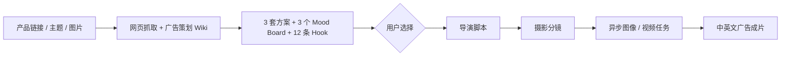

# 大海浮光｜跨境电商短视频智能生产系统

**Ocean Glimmer — AI Design & AIGC Advertising Workbench**

[中文介绍](#60-秒看懂) · [English Summary](#english-summary)

输入商品链接、营销要求和产品图片，系统自动完成商品分析、广告创意、导演脚本、拍摄分镜和短视频生成。

传统广告短视频制作需要分别整理商品资料、构思创意、编写脚本、设计分镜并操作多个生成工具，流程分散且依赖个人经验。大海浮光把这些环节整合进一个网页工作台，让用户在同一系统内完成从商品资料到广告成片的完整流程。

系统结合飞书广告知识库，一次生成 **3 套完整创意方案和 12 个 Hook** 供用户比较。用户选定方向后，系统继续生成导演脚本、摄影分镜并提交视频任务，同时显示进度、保留失败信息并将成片自动回写到工作台。

它不是单次 Prompt Demo。项目重点是把**产品事实、专业知识、人的创意选择和异步媒体生成**组织成一条可选择、可追踪、可恢复的生产链。

> 求职方向：AIGC 应用 · AI 产品 · Agent 工作流 · Creative Technologist · 跨境内容自动化

## 60 秒看懂

| 先看什么 | 入口 |
| --- | --- |
| 真实中英文成片 | [中文成片](frontend/showcase/videos/中文视频-国内电商/美白奶罐_高端TVC_0729_0434.mp4) · [English cut](frontend/showcase/videos/英文视频-跨境电商/veo-2_字幕.mp4) · [16 个完整视频目录](frontend/showcase/README.md) |
| 工作台实际效果 | [真实运行快照](frontend/showcase/workbench/open-design-demo.html?demo=1) · [作品目录](frontend/showcase/README.md) |
| 一次完整产品决策 | [Case Study](docs/CASE_STUDY.md) |
| 系统如何拆分 | [架构说明](docs/ARCHITECTURE.md) |

### 视频作品｜直接播放

中文视频区仅保留华为品牌信息流作品。每条成片的第 1 秒都是产品封面，GitHub 页面可直接播放。

#### 中文信息流广告

<table width="100%">
<colgroup><col width="33%"><col width="33%"><col width="33%"></colgroup>
<tr>
<td width="33%" valign="top"><strong>01｜华为品牌信息流 · 广告 1</strong><br><video src="https://github.com/user-attachments/assets/bb893083-e30f-411b-a85a-139d430d5e97" controls preload="metadata" width="100%"></video></td>
<td width="33%" valign="top"><strong>02｜华为品牌信息流 · 广告 2</strong><br><video src="https://github.com/user-attachments/assets/9aa5d543-ece7-41b3-b7d7-f721f921ed45" controls preload="metadata" width="100%"></video></td>
<td width="33%" valign="top"><strong>03｜华为品牌信息流 · 广告 3</strong><br><video src="https://github.com/user-attachments/assets/b500b609-b2a1-4217-a32d-d1d02b5e4fdc" controls preload="metadata" width="100%"></video></td>
</tr>
<tr>
<td width="33%" valign="top"><strong>04｜华为品牌信息流 · 广告 4</strong><br><video src="https://github.com/user-attachments/assets/0dffd6f9-0732-4876-a7db-2a06b4ab83da" controls preload="metadata" width="100%"></video></td>
<td width="33%" valign="top"><strong>05｜华为品牌信息流 · 广告 5</strong><br><video src="https://github.com/user-attachments/assets/78d4dbd7-4061-4df9-a7ac-3a1d5d6faecd" controls preload="metadata" width="100%"></video></td>
<td width="33%" valign="top"></td>
</tr>
</table>

#### 英文信息流广告

<table>
<tr>
<td><strong>01｜英文跨境美妆广告 · Veo 2</strong><br><video src="https://github.com/user-attachments/assets/f037c40c-4688-4c84-902f-a2a79bdd1379" controls preload="metadata" width="280"></video></td>
<td><strong>02｜英文跨境美妆广告 · 成片 01</strong><br><video src="https://github.com/user-attachments/assets/cf11b849-4f57-4f31-8947-159efe9aba8c" controls preload="metadata" width="280"></video></td>
<td><strong>03｜英文跨境美妆广告 · 成片 02</strong><br><video src="https://github.com/user-attachments/assets/e23a1052-db38-46f1-8c1d-67a40fba8665" controls preload="metadata" width="280"></video></td>
</tr>
<tr>
<td><strong>04｜英文跨境美妆广告 · 成片 03</strong><br><video src="https://github.com/user-attachments/assets/144f9be2-1267-4236-a59b-9c1a7afd4fc7" controls preload="metadata" width="280"></video></td>
<td><strong>05｜英文跨境美妆广告 · 成片 04</strong><br><video src="https://github.com/user-attachments/assets/8271892f-2035-4129-a70d-30b7529d80a9" controls preload="metadata" width="280"></video></td>
<td></td>
</tr>
</table>

## English Summary

Ocean Glimmer is an AI advertising production system that turns product links, marketing requirements, and reference images into structured advertising concepts, director scripts, shot lists, and short-form videos.

It was created to reduce repeated product-information collection, disconnected creative tools, one-direction model outputs, and long-running video tasks with no visible status. The workbench brings these steps into one browser-based workflow:

1. analyse the product and organise its selling points, audience, usage scenarios, and communication priorities;
2. read role-specific advertising knowledge from Feishu Wiki;
3. generate three complete creative directions and twelve Hooks for comparison;
4. let the user select the preferred Hook and visual direction;
5. convert the selected concept into a director script and cinematography plan;
6. submit image and video generation tasks, display progress, preserve failures, and write the completed video back to the workbench.

The system separates advertising planning, directing, cinematography, and media execution instead of asking one model to complete everything in a single prompt. Human review remains at the key creative decision, while structured state and task polling keep the workflow selectable, traceable, and recoverable.

**Recruiter takeaway:** this project demonstrates both advertising and visual-design judgment, and the ability to turn that creative capability into a working, repeatable AI production system.

## 我解决的问题

直接调用大模型生成广告，通常会遇到四个问题：

- 产品事实容易被创意内容污染；
- 模型一次只给出一个方向，用户没有真正的决策点；
- Hook、脚本、分镜和成片之间容易失去上下文；
- 视频生成耗时较长，任务状态和最终结果难以稳定回写。

因此，我把生产过程拆成三个内容决策阶段和一个媒体执行阶段：



## 关键产品设计

### 1. 人不是流程末端的审核员

Stage 1 先提供可比较的 Hook、Mood Board 和创意方案，由用户确定方向后再进入导演与摄影阶段。用户选择会以 `plan_id`、`hook_id` 和 `mood_board_id` 继续传递，而不是被下一次模型调用覆盖。

### 2. 知识库负责方法，模型负责推理

飞书 Wiki 被划分为广告策划、编剧导演和摄影摄像三个知识域。每个阶段只读取与当前角色有关的知识，并通过 `knowledge_trace` 记录实际读取状态，避免把历史生成记录误当成方法论。

### 3. 内容生成与媒体任务分开

Python 负责知识读取、模型调用、模板路由和结构化契约；n8n 负责图片、视频、轮询、对象存储和结果回写。这样可以独立替换模型或媒体供应商，而不必重写整条业务流程。

### 4. 长任务不会阻塞前端

视频生成会立即返回任务 ID，前端随后轮询状态。最终视频与上游产品简报、创意方案、分辨率和 pipeline trace 一起保存，页面刷新后仍可恢复结果。

## 本项目展示的能力

| 能力 | 项目中的落地 |
| --- | --- |
| AI 产品设计 | 将广告生产拆成可验证阶段，并设置人工创意决策点 |
| Agent / 工作流 | 广告策划、导演、摄影角色分工与上下文交接 |
| 多模态应用 | 同时处理产品网页、营销主题和产品图片 |
| 知识库应用 | 飞书 Wiki 分角色读取、知识追踪、无静默本地替代 |
| 结构化生成 | 通过 Pydantic、ID 和 JSON contract 连接不同阶段 |
| 模型路由 | Gemini、DeepSeek及图像/视频模型按阶段与语言分工 |
| 异步编排 | n8n 任务提交、状态轮询、失败处理和结果回写 |
| 工程交付 | Node 同源代理、TOS 对象存储、FFmpeg、测试与敏感信息扫描 |

## 技术架构

| 层级 | 技术 | 职责 |
| --- | --- | --- |
| 前端 | HTML、CSS、JavaScript | 产品输入、方案选择、阶段确认、媒体预览 |
| 网关 | Node.js | 静态服务、同源 API 代理、状态保存与恢复 |
| AI 内容服务 | Python、Pydantic | 抓取、知识读取、模型路由、输出校验 |
| 知识层 | 飞书 Wiki | 广告策划、编剧导演、摄影摄像方法论 |
| 文本与多模态模型 | Gemini 3.1 Pro、DeepSeek | Hook、Mood Board、脚本、摄影分镜 |
| 编排层 | n8n | 图像与视频任务、等待、轮询、回写 |
| 媒体层 | 火山 TOS、FFmpeg | 公网素材、生成结果与本地后期处理 |

## 真实生产链路

1. 网页抓取与广告策划 Wiki 并发读取。
2. Gemini 3.1 Pro 读取产品图和知识，一次生成产品简报、3 个 Mood Board、3 套方案和12条 Hook。
3. 用户选择 Hook 后，系统读取编剧导演 Wiki，生成完整导演脚本。
4. 摄影阶段读取摄影摄像 Wiki，将脚本转换为逐镜任务和视频提示词。
5. n8n 提交媒体任务并轮询状态，最终将成片回写到前端。

## 我实际处理过的工程问题

- 飞书 Wiki 权限、节点类型和文档读取失败；
- 本地图片无法被远程多模态模型访问；
- 模型连接中断、超时、返回字段变化和结构化结果缺失；
- 前端重复提交导致同一 Stage 被触发两次；
- 本地服务端口冲突与多进程重复启动；
- 视频任务耗时较长，HTTP 请求不应一直阻塞；
- 分辨率、Hook 和创意方案在多阶段传递中丢失；
- 视频生成成功但前端未收到最终回写；
- API Key、工作流凭据和对象存储地址的公开安全边界。

## 项目结构

```text
.
├── frontend/
│   ├── open-design.html       # 正式工作台
│   ├── portfolio.html         # 作品集页面
│   └── server.mjs             # Node 网关与统一代理
├── python_service/
│   ├── server.py              # Stage 1 / 2 / 3 API
│   ├── prompts.py             # 结构化提示词契约
│   ├── feishu_knowledge.py    # Wiki 知识读取
│   └── gemini_kie.py          # Gemini 3.1 Pro 通道
├── n8n-workflows/public/      # 脱敏公开工作流
├── docs/knowledge/            # 三类知识库整理版
├── docs/                      # 架构、Case Study 与接口文档
├── scripts/                   # 检查、导出和安装工具
├── .env.example
└── package.json
```

## 本地运行

```bash
npm install
python3 -m pip install -r python_service/requirements.txt
npm exec playwright install chromium
cp .env.example .env
npm start
```

默认入口：

- 工作台：<http://localhost:4174>
- Python 健康检查：<http://127.0.0.1:8787/health>
- n8n：<http://127.0.0.1:5678>（独立启动）

详细配置见 [安装说明](docs/SETUP.md)。真实密钥只存放在本机 `.env` 或 n8n Credentials 中。

## 质量与公开安全

```bash
npm run check
```

检查覆盖 Node 入口、Python 单元测试、公开 n8n 工作流、阶段数据契约及敏感信息。GitHub Actions 会在 push 和 Pull Request 时执行同一套检查。

公开仓库不包含 `.env`、API Key、n8n 数据库、Credential、真实业务记录、私有对象存储地址和本机运行日志。

## 当前边界

- 当前是可运行、可检查、可展示的 AI 应用原型，不将单次生成质量包装成商业 SLA。
- 真实运行需要使用者自己的模型、飞书、TOS 与 n8n 凭据。
- 下一步计划增加多国家本地化、批量矩阵生成、成本统计与传播数据反馈。

## 进一步阅读

- [Case Study](docs/CASE_STUDY.md)
- [系统架构](docs/ARCHITECTURE.md)
- [接口契约](docs/WORKFLOW_CONTRACTS.md)
- [飞书知识库接入](docs/FEISHU_KNOWLEDGE.md)
- [GitHub 发布检查](docs/GITHUB_RELEASE.md)
