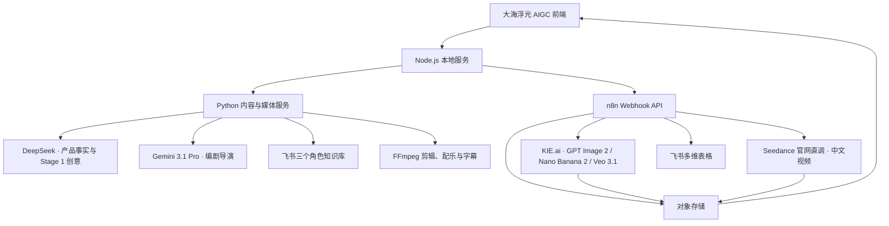

# 系统架构

## 设计目标

系统把产品抓取、LLM JSON 生成和本地媒体处理交给 Python，把高延迟、需要 Wait/轮询和飞书集成的任务留在 n8n。浏览器负责选择、确认、编辑和结果展示。

## 组件边界



## 飞书双层数据架构

三个角色 Wiki 文档是唯一知识层，保存广告策划、编剧导演和摄影摄像的方法与约束。`AI 视频工厂工作台` 是运行数据层，只保存产品、Hook、脚本和视频任务；运行台账与知识源严格分离。

前端筛选器由知识层生成，所选值通过 `filter_values` 同时进入 Python 提示词和 n8n 媒体工作流。具体字段、权限和验证方法见 [飞书知识库接入](FEISHU_KNOWLEDGE.md)。

## 四个角色与后端边界

前端用三个岗位表达用户任务，后端仍按可维护的技术边界拆成多个工作流：

| 前端角色 | n8n 工作流 | 原因 |
| --- | --- | --- |
| 广告策划 | Python Stage 1 + DeepSeek + Gemini 3.1 Pro | 页面抓取 → DeepSeek 产品事实 → 广告策划 Wiki → Gemini 生成 Mood Board、12 个 Hook 与结构化 JSON |
| 编剧导演 | Python Stage 2 + Gemini 3.1 Pro | 读取编剧导演知识，生成脚本与导演分镜 |
| 摄影摄像 | Python Stage 3 + Gemini-KIE；n8n 04 / 05 | 读取摄影摄像知识，生成精细分镜；n8n 负责后续图片、视频任务与轮询 |
| 后期剪辑 | Python FFmpeg Worker | 截取、画幅转换、配乐混音和字幕烧录 |

公开 n8n 只保留 03 / 04 / 05。正式入口的 Stage 3 先走 Python 摄影知识；03 仅作为需要 n8n 建档的兼容模板。已迁移的 01 / 02 历史模板不再进入公开仓库，也不作为正式运行依赖。

## 模型路由

| 能力 | 默认供应商 | 运行边界 | 失败策略 |
| --- | --- | --- | --- |
| 产品事实 | DeepSeek | Python | 事实整理失败就停止 Stage 1，不让创意模型猜测 |
| 产品事实与产品简报 | DeepSeek | Python | 只整理可验证事实，不提前创作 Hook |
| Mood Board 与创意方案池 | Gemini 3.1 Pro | Python | 读取广告策划 Wiki 后生成 12 个 Hook 与结构化结果 |
| 编剧与导演分镜 | Gemini 3.1 Pro | Python | 可配置回退 DeepSeek |
| 主人公形象 | KIE.ai GPT Image 2 | n8n 05 提交、等待、轮询与回写 | 保留任务 ID，可重新生成 |
| 9:16 多宫格分镜图 | KIE.ai Nano Banana 2 | n8n 05 提交、等待、轮询与回写 | 保留任务 ID，可重新生成 |
| 中文视频 | Seedance 官网直调 | n8n | 沿用现有等待、轮询、回写链路 |
| 英文/海外视频 | KIE.ai Veo 3.1 | n8n（预留） | 与中文视频使用同一标准结果对象 |

所有供应商结果都归一为 `task_id / status / urls / provider / model`，前端不直接依赖供应商原始字段。

Python 同时提供 KIE 适配接口，便于本地测试或未来将任务提交移出 n8n；正式前端默认仍由 n8n 05 承担图片异步编排，避免出现两个轮询器争抢同一任务。

## 状态模型

```text
idle
  -> planning
  -> hooks_ready
  -> writing_script
  -> directing_storyboard
  -> storyboard_ready
  -> generating_images (optional)
  -> generating_video
  -> assembling (multi-segment only)
  -> completed
  -> failed
```

脚本/分镜生成和视频生成必须使用不同状态判断。前端只在 `loadingMsg` 明确包含“生成视频”或“合成成片”时点亮视频生成状态，避免两个阶段的等待 UI 联动。

## 媒体生命周期

模型供应商返回的临时 URL 不应作为最终资产。生产流程应将图片和视频下载到对象存储，再把持久 URL 写回飞书并返回前端。

## 公开仓库边界

公开：

- 前端和本地代理代码
- 已脱敏的 n8n 模板
- 字段与接口契约
- 示例配置和演示媒体

不公开：

- n8n SQLite 数据库
- API Key、Bearer Token、App Secret
- 飞书 App Token、Table ID 和真实记录
- 本机路径、终端日志、恢复文件和历史备份
