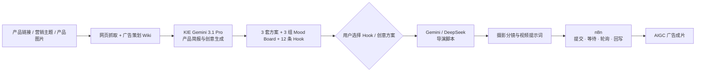

# Case Study：让产品事实贯穿 AIGC 广告生产

## 案例结果

本案例跑通了从商品资料到广告成片的完整流程。

用户只需提交一次产品链接、营销主题或产品图片。系统先生成产品简报、3 套创意方案、3 组 Mood Board 和 12 条 Hook。

用户确认方向后，系统继续生成导演脚本、摄影分镜和视频提示词。随后，n8n 提交并追踪媒体任务，将最终成片回写到工作台。

用户选择的 `plan_id`、`hook_id` 和 `mood_board_id` 会持续传递。视频任务通过 `video_task_id` 进行追踪。

## 背景

传统人工制作一条信息流广告，需要策划、编导、演员、场地、拍摄和后期多人配合，成本通常在数千至上万元。创意方向调整后，还可能产生补拍和重剪。

AIGC 降低了视频生成门槛，但现有工具大多只覆盖单个环节。用户仍需编写提示词、切换多个 AI 软件，并手动传递产品资料和创意要求。不同阶段之间很容易丢失产品事实和创意方向。

这个案例要解决的，不是如何调用模型生成一个视频片段，而是如何把产品资料、创意选择、脚本、分镜、视频和后期连接成一条完整工作流。用户负责选择方向，四个 Agent 接力完成制作。

## 核心产品决策

最关键的设计不是“全自动生成”，而是在 Stage 1 之后加入用户决策点。

系统先提供多套创意方向。用户完成比较和选择后，后续任务再继续执行。

这样设计有三个作用：

- 产品资料、广告知识和创意输出被保存在同一个结构化契约中；
- 用户可以比较多套方案，不必接受模型生成的单一路线；
- 后续任务可以关联到用户已经确认的创意方向。

## 系统如何落地

### 1｜内容契约

[python_service/server.py](../python_service/server.py) 使用 Pydantic 定义 Stage 1 和 Stage 2 的输入与输出。

它负责产品品类识别、模板路由、Hook 与 Mood Board 规范化，以及阶段结果校验。

模型输出不会直接传给下一阶段。系统会先将它转换成结构化对象，再继续执行。

这一步可以减少字段缺失、格式变化和阶段数据失控。

### 2｜知识边界

[python_service/feishu_knowledge.py](../python_service/feishu_knowledge.py) 将广告策划、编剧导演和摄影摄像三个 Wiki 角色隔离。

每个阶段只读取自己的角色知识：

- 广告策划阶段读取产品分析与广告创意知识；
- 编剧导演阶段读取脚本与导演知识；
- 摄影摄像阶段读取镜头与画面生成知识。

`knowledge_trace` 会记录真实 Wiki 的读取状态。系统不使用本地内容 fallback 冒充知识库结果。

### 3｜创意上下文传递

Stage 1 会生成 `plan_id`、`hook_id` 和 `mood_board_id`。

用户确认方向后，这些 ID 会继续传递给导演脚本、摄影分镜和媒体任务。

后续 Agent 不会重新猜测创意方向，而是继承用户已经确认的结果。

### 4｜同源网关与状态恢复

[frontend/server.mjs](../frontend/server.mjs) 负责连接前端、Python 和 n8n。

内容任务转发给 Python，媒体任务转发给 n8n。

网关同时保存以下状态：

- 用户选择的创意方案；
- Hook 与 Mood Board；
- 视频分辨率；
- 视频任务 ID；
- 最终视频地址；
- Pipeline Trace。

页面刷新后，系统仍然可以恢复任务状态和生成结果。

### 5｜异步媒体编排

[n8n-workflows/public/04-video-generation.json](../n8n-workflows/public/04-video-generation.json) 负责处理视频生成任务。

完整流程包括：

1. 提交图片或视频任务；
2. 保存供应商任务 ID；
3. 等待并轮询任务状态；
4. 处理分段生成结果；
5. 获取最终视频地址；
6. 将结果回写到工作台。

视频生成不再阻塞 HTTP 请求。用户也可以持续查看任务进度。

## 为何选用 n8n 低代码与 Python 混合架构

Python 负责产品事实、内容契约、模型路由和结果校验。

这些逻辑需要单元测试、版本控制和精细的错误处理，因此不适合全部放进低代码节点。

n8n 负责图片与视频任务的提交、等待、轮询和结果回写。

这些流程需要频繁连接外部 API，更适合通过低代码工作流快速编排。

这种混合架构兼顾了开发效率和工程稳定性。模型供应商或媒体工作流可以单独替换，不需要重写 Stage 1–3 的核心逻辑。

## 结果验证

本案例完成了以下验证：

- Stage 1 单次生成 3 套创意方案、3 组 Mood Board 和 12 条 Hook；
- 用户选择通过 `plan_id`、`hook_id` 和 `mood_board_id` 传递到后续阶段；
- 视频任务通过 `video_task_id` 持续追踪；
- `knowledge_trace` 记录每个阶段的知识读取状态；
- Pipeline Trace 记录内容生成、媒体提交和结果回写；
- 最终视频地址能够保存并回写到前端；
- 页面刷新后可以恢复任务状态。

## 当前边界

- 真实模型、飞书 Wiki、TOS 和 n8n 需要使用者自己的凭证与服务实例；
- `npm start` 负责启动本地前端、Python 和 Playwright 爬虫；
- n8n 作为独立服务运行；
- 公开 Demo 使用固定 Mock 数据，不调用真实供应商；
- 当前定位是可运行、可检查、可展示的 AIGC 应用原型，不代表商业生产 SLA。
