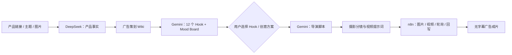

# Case Study：从产品事实到无字幕广告视频

## 背景

商业广告生产通常同时包含产品资料整理、创意策划、脚本、摄影分镜和媒体生成。单次调用文生视频模型可以快速得到一个片段，但很难保证产品事实、品牌限制、创意方向和最终素材之间保持一致。

这个项目把它做成一个带人工决策点的生产工作台：模型负责推理，系统负责边界、交接和状态。

## 产品决策

最关键的设计不是“全自动生成”，而是把用户选择放在 Stage 1 之后：

这样做有三个好处：

- 产品事实和创意推演分离，减少模型凭空补写参数、功效和竞品信息。
- 用户在方向真正确定之前拥有选择权，不必接受模型单一路线。
- 后续脚本、分镜和媒体任务都能关联回 `plan_id`、`hook_id`、`mood_board_id` 和 `video_task_id`。

## 系统如何落地

### 1. 内容契约

[python_service/server.py](../python_service/server.py) 用 Pydantic 定义 Stage 1/2 输入，并负责模板路由、产品品类识别、Hook/Mood Board 规范化和阶段结果校验。模型输出先被转换成结构化对象，再交给下一阶段。

### 2. 知识边界

[python_service/feishu_knowledge.py](../python_service/feishu_knowledge.py) 将广告策划、编剧导演、摄影摄像三个 Wiki 角色隔离。每个阶段只读取自己的知识角色，并在 `knowledge_trace` 中记录来源是 Wiki 还是本地 fallback。

### 3. 媒体编排

[frontend/server.mjs](../frontend/server.mjs) 是同源网关：内容阶段转发到 Python，媒体阶段转发到 n8n，并把最终视频 URL、选中的创意方案、分辨率和 pipeline trace 保存为可恢复状态。

[n8n-workflows/public/04-video-generation.json](../n8n-workflows/public/04-video-generation.json) 则集中处理异步视频任务、等待、轮询、分段结果和成片回写。

## 为什么不是一个巨型 n8n 工作流

内容契约、产品事实和模板路由需要单元测试、版本控制和更细的错误处理，因此放在 Python；等待、轮询和供应商 API chaining 是 n8n 更擅长的部分，因此放在 n8n。

这种拆分让模型供应商或编排器可以替换，而不会让 Stage 1–3 的产品逻辑全部重写。

## 如何在面试中讲清楚

> 我做的不是一个 Prompt Demo，而是一条带 human-in-the-loop 的 AI 广告生产链。系统先把产品事实和创意推演分开，再让用户选择 Hook 和 Mood Board，之后通过结构化 contract 把方案交给导演、摄影和媒体编排阶段。Python 保证内容边界，模型负责推理，n8n 负责异步媒体任务，Node 网关负责同源代理和状态恢复。

## 当前边界

- 真实模型、飞书 Wiki、TOS 和 n8n 仍需要用户自己的凭证与服务实例。
- `npm start` 启动本地前端、Python 和 Playwright 爬虫；n8n 作为独立服务运行。
- 项目当前定位是可运行、可检查、可展示的 AI 应用原型，不把单次模型生成质量包装成稳定的商业生产 SLA。
