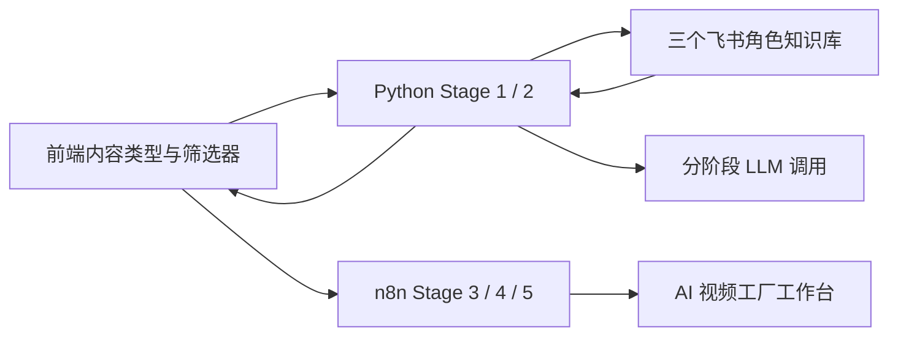

# 飞书知识库接入

## 三个 Wiki 是唯一知识源

系统只把以下三个飞书 Wiki 文档当作知识库。产品、Hook、脚本和视频任务的运行记录属于任务台账，不能反过来作为方法论知识读取。

正式 Wiki 首页：`M7vMw2iNIia1yxkqPPzcgEpXn9g`

| 角色 | Wiki 文档节点 |
| --- | --- |
| 广告策划 | `XLdRwFy4RiDNvykEXXtcc39UnIe` |
| 编剧导演 | `KikywYv7iiJ0zSkY8HdcLoCEnwf` |
| 摄影摄像 | `DhlgwqOcbiH073kfmpzcc0O0nsW` |

## 三个角色 Wiki 的内容范围

### 广告策划

- 产品事实的整理边界、目标用户、核心卖点和卖点转译
- 核心视觉资产、场景资源、Campaign 主题、情绪母版和创意方案规则
- 甲方限制、禁止表达和 Stage 1 输出契约

Stage 1 读取广告策划 Wiki，生成 `product_brief`、3 个 `mood_boards`、3 个 `creative_plans`、12 个 `hooks` 和 `recommended_plan_id`。

### 编剧导演

- 叙事时间轴与动线约束
- 导演角色设定和内容类型下的表达方式
- 输出格式模板、分镜字段和 Stage 3 交接规则
- 品牌参考案例与连续性约束

### 摄影摄像

- 视频安全策略、运镜与节奏、画面影调、视觉焦点
- 参考视频、视频核心指令、视觉强约束、产品和人物连续性

Wiki 文档正文不会整篇无限灌入模型。`python_service/feishu_knowledge.py` 按角色读取对应节点、缓存 5 分钟，再按 `top_k` 和字符上限注入阶段提示词。代码不再读取多维表格记录，也不再根据多维表格字段名匹配知识。

## 阶段调用边界

| 阶段 | 读取角色 | 目的 |
| --- | --- | --- |
| Stage 1 | 广告策划 | 产品简报、Mood Board、完整创意方案池 |
| Stage 2 | 编剧导演 | 把已选创意方案转为脚本与导演分镜 |
| Stage 3 | 摄影摄像 | 把脚本和方案转为可执行镜头与视频生成提示词 |

每个阶段只请求自己的角色 Wiki，不读取另外两库。Stage 1 内部顺序是“爬虫 → 产品事实模型 → 广告策划 Wiki → 创意模型”；Stage 2 只读取编剧导演 Wiki；Stage 3 只读取摄影摄像 Wiki。服务进程内默认缓存 5 分钟，提示词按阶段限制在 4000～5200 字符。这样前端等待的是一次角色级读取，而不是把全部文档逐个塞入模型。

如果 Wiki 暂时不可用，服务使用内置的最小结构化安全契约保证链路可运行，并在 `knowledge_trace` 标明 `fallback`。只有真实 Wiki 正文读取成功时，阶段来源才标记为 `wiki`。

## 运行方式



1. 前端按内容类型请求 `/api/knowledge/filters`。
2. Python 从对应角色 Wiki 提取筛选项；未授权时返回内置安全配置。
3. Stage 1 先调用产品事实模型，再读取广告策划 Wiki，最后调用创意模型生成 12 个 Hook 和简要 Mood Board。
4. 前端选择一个 Hook，连同对应的 `creative_plan` 和完整 `selected_mood_board` 原样传给 Stage 2。
5. Stage 2 只读取编剧导演 Wiki，生成脚本和分镜；Stage 3 只读取摄影摄像 Wiki，生成镜头提示词。
6. `filter_values`、已选创意方案、Mood Board、脚本、分辨率和无字幕约束继续传给 n8n Stage 4。
7. n8n 只负责视频异步提交、轮询、存储和回写，结果返回同一个前端入口。

产品事实和甲方限制的优先级始终高于创意知识，模型不得根据知识库虚构功效或数据。

## 本地配置

在私有 `.env` 中配置。三份 Wiki 节点是唯一知识配置：

```dotenv
FEISHU_APP_ID=
FEISHU_APP_SECRET=
FEISHU_API_BASE_URL=https://open.feishu.cn/open-apis
FEISHU_KNOWLEDGE_CACHE_SECONDS=300

FEISHU_KNOWLEDGE_WIKI_ROOT_TOKEN=
FEISHU_PLANNING_WIKI_TOKEN=
FEISHU_DIRECTOR_WIKI_TOKEN=
FEISHU_CAMERA_WIKI_TOKEN=
```

真实 App Secret 和 Wiki 节点 token 不得写入 `.env.example`、前端或 Git。

## 飞书授权步骤

1. 打开飞书开放平台，进入用于本项目的企业自建应用。
2. 在“凭证与基础信息”中复制 App ID 和 App Secret，写入本机 `.env`。
3. 在“权限管理”中开通 Wiki 节点读取和云文档正文读取权限。
4. 如飞书要求发布后权限才生效，创建并发布一个应用版本。
5. 分别打开三个角色 Wiki 文档，点击“分享”或“协作者”，添加该应用并授予可阅读权限。
6. 重启服务：`npm run dev`。
7. 访问以下地址验证：

```text
http://127.0.0.1:4173/api/knowledge/filters?content_type=高端TVC
```

返回 `"source":"wiki"` 表示真实 Wiki 已接通；阶段接口的 `knowledge_trace.source` 为 `wiki` 表示对应角色 Wiki 正文已进入上下文；返回 `"source":"fallback"` 表示应用凭证、文档协作权限或网络仍未生效。
