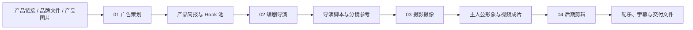
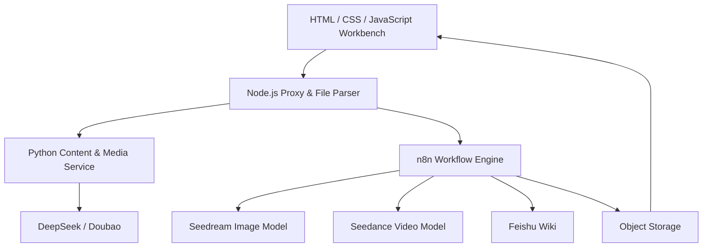

# 大海浮光 AIGC

> 面向国内与跨境美妆品牌的 AI 视频生产 Agent SaaS

大海浮光 AIGC 将产品链接、品牌资料、产品图片和 Office 文件转换为产品简报、营销 Hook、导演脚本、分镜参考图、主人公形象与广告成片。

它不是单一的文生视频页面，而是一套专门理解美妆商品、内容表达和广告生产流程的智能工作台。

## Product Preview


- [本地产品体验](http://localhost:4173/open-design.html?demo=1)
- [产品与视频作品集](http://localhost:4173/portfolio.html)

## Why Beauty

美妆视频生产对商品一致性、人物肤质、功效表达、品牌审美和内容合规都有更高要求。通用视频生成工具可以生成画面，但很难稳定产出真正可投放的美妆内容。

大海浮光 AIGC 聚焦以下问题：

- 保持瓶身、包装、Logo、色号与材质的一致性
- 根据真人口播、专业测评和高端 TVC 区分内容语言
- 生成适合护肤、彩妆和个护产品的镜头与视觉提示词
- 支持简体中文、繁体中文、粤语及英文内容本地化
- 将脚本、图片和视频任务拆分为可追踪、可重试的生产流程
- 为品牌团队保留人工选择、修改和确认节点

## Content Modes

| 内容类型 | 创作原则 | 典型使用场景 |
| --- | --- | --- |
| 真人口播带货 | 第一人称、真实体验、生活化表达 | 达人短视频、店播素材、UGC 广告 |
| 好物推荐 | 产品力、功效对比、成分与证据 | 专业测评、产品种草、转化广告 |
| 高端 TVC | 意象语言、电影叙事、品牌情绪 | 品牌广告、新品发布、形象传播 |

## Workflow

工作台按照真实广告团队的四个角色组织生产流程：



### 01 广告策划

- 解析商品页面、图片及 DOCX / XLSX / PPTX 文件
- 提炼核心卖点、目标人群、使用场景和传播角度
- 根据内容类型生成并筛选营销 Hook

### 02 编剧导演

- 确认选中的 Hook 和创意方向
- 生成 15 / 30 / 45 / 60 秒导演脚本
- 输出逐镜头画面、运镜、台词、声音和视频提示词
- 生成 9:16 多宫格分镜参考图

### 03 摄影摄像

- 描述并生成真人达人或动画角色参考形象
- 提交单段或多段视频生成任务
- 持续轮询任务状态并将结果回写播放器
- 预览、管理和下载最终成片

### 04 后期剪辑

- 截取源视频并转换 9:16、16:9 或 1:1 画幅
- 上传配乐、控制混音音量并烧录字幕
- 输出可播放、可下载的 H.264 MP4

## Architecture



## Repository

```text
.
├── frontend/
│   ├── open-design.html       # 正式产品工作台
│   ├── portfolio.html         # 项目与分类成片作品集
│   ├── server.mjs             # 本地服务、文件解析和 n8n 代理
│   └── showcase/
│       ├── workbench/         # 脱敏产品演示
│       ├── videos/            # 分类演示成片
│       └── posters/           # 视频封面
├── n8n-workflows/
│   ├── public/                # 可公开导入的脱敏工作流
│   └── README.md
├── docs/
│   ├── ARCHITECTURE.md
│   ├── SETUP.md
│   ├── WORKFLOW_CONTRACTS.md
│   └── GITHUB_RELEASE.md
├── scripts/                   # 导出、校验和脱敏检查
├── .env.example
└── package.json
```

## Quick Start

### 1. Install

```bash
npm --prefix frontend install
cp .env.example .env
```

### 2. Prepare n8n

启动本地 n8n，然后导入 `n8n-workflows/public/` 中的脱敏模板，并绑定自己的模型、飞书与存储 Credentials。

```text
http://127.0.0.1:5678
```

### 3. Start

```bash
npm run dev
```

打开：

```text
http://127.0.0.1:4173/open-design.html?demo=1
http://127.0.0.1:4173/portfolio.html
```

## Public Workflow Templates

1. 产品资料 → 产品简报与 Hook
2. 选中 Hook → 导演脚本
3. 导演脚本 → 结构化分镜
4. 结构化分镜 → 分镜参考图
5. 视频任务 → 生成、轮询与成片回写

所有公开模板默认关闭激活状态，不包含 Credentials ID、API Key、飞书 Token、业务表格 ID、本地数据库或真实客户数据。

## Product Roadmap

- [x] 产品链接与 Office 文件解析
- [x] 美妆产品简报与多类型 Hook
- [x] 导演脚本和结构化分镜
- [x] 主人公形象与分镜图生成
- [x] 视频任务轮询与播放器回写
- [ ] 美妆商品一致性检查
- [ ] 功效宣称与敏感词合规检查
- [ ] 繁体中文、粤语与英文内容本地化
- [ ] 多品牌资产库与团队审批
- [ ] 批量视频矩阵与投放数据反馈

## Security

浏览器端不保存第三方 API 密钥。正式凭证应配置在 n8n Credentials 或本地环境变量中。

公开发布前执行：

```bash
npm run check
```

仓库不应包含：

- n8n 数据库和执行历史
- API Key、Bearer Token 或 App Secret
- 飞书 App Token、Table ID 和真实业务数据
- 客户产品资料、内部素材和未公开成片
- 本机路径、终端日志和恢复文件

## Project Status

当前版本是一个完成核心闭环的本地 MVP，可展示：

- 垂直行业 AI 产品设计
- n8n 工作流与模型编排
- 多媒体异步任务管理
- 前后端接口设计
- 人机协作与内容生产体验

下一阶段将围绕美妆商品一致性、广告合规、跨市场本地化和批量生产继续深化。

## Documentation

- [系统架构](ARCHITECTURE.md)
- [安装与配置](SETUP.md)
- [接口契约](WORKFLOW_CONTRACTS.md)
- [GitHub 发布检查](GITHUB_RELEASE.md)
