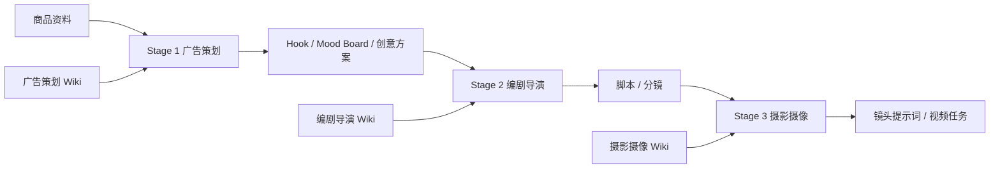

# 知识库公开索引

这个目录展示大海浮光 AIGC 工作台的三类角色知识库如何进入生成链路。完整知识正文保留在飞书 Wiki 中，GitHub 只公开可审查的链接、脱敏样例、字段结构、检索 trace 和评估记录。

## 三个角色知识库

| 角色知识库 | 飞书 Wiki | 运行阶段 | GitHub 样例 |
| --- | --- | --- | --- |
| 广告策划 | <https://pcn7bpsihajy.feishu.cn/wiki/XLdRwFy4RiDNvykEXXtcc39UnIe> | Stage 1：产品 Brief、Mood Board、Hook、创意方案 | [planning/sample-chunks.md](planning/sample-chunks.md) |
| 编剧导演 | <https://pcn7bpsihajy.feishu.cn/wiki/KikywYv7iiJ0zSkY8HdcLoCEnwf> | Stage 2：脚本、导演说明、分镜拆解 | [directing/sample-chunks.md](directing/sample-chunks.md) |
| 摄影摄像 | <https://pcn7bpsihajy.feishu.cn/wiki/DhlgwqOcbiH073kfmpzcc0O0nsW> | Stage 3：镜头语言、画面约束、视频生成提示词 | [cinematography/sample-chunks.md](cinematography/sample-chunks.md) |

## 公开展示范围

- `planning/`：广告策划知识的脱敏片段，覆盖产品事实边界、目标人群、卖点转译和 Hook 生成规则。
- `directing/`：编剧导演知识的脱敏片段，覆盖脚本节奏、镜头段落和口播/字幕交接规则。
- `cinematography/`：摄影摄像知识的脱敏片段，覆盖产品视觉焦点、运镜、光线和视频提示词约束。
- `retrieval/metadata-schema.json`：知识块元数据字段，说明检索系统如何按角色、阶段、内容类型和语言筛选。
- `retrieval/example-trace.json`：一次 Mock 全流程的知识检索记录，展示哪些角色知识被读入。
- `evaluation/benchmark-results.md`：公开基准记录，区分 Mock 测试、结构化契约测试和真实供应商调用边界。

## 与产品链路的关系

每个阶段只读取自己的角色知识库，`knowledge_trace` 记录本次调用读到了哪些知识块。公开 Demo 使用固定 Mock 数据，不请求飞书、模型、n8n 或对象存储。
